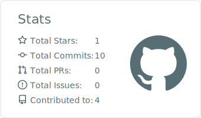
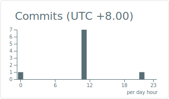
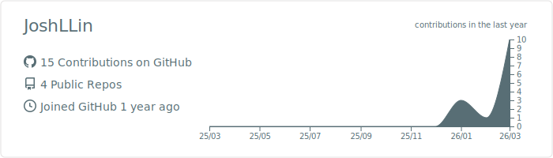

  

# Hey 👋, I'm JoshLLin!

  

    
    
  

### About me

- 🔭 I’m currently a Computer Science sophomore (Class of '24).
- 🌱 I’m diving deep into **Data Structures, Algorithms, and Deep Learning**.
- 👯 I’m actively building projects.
- 🛠️ I love coding in **C++** and **Python**, training models with **PyTorch**, and deploying via **Docker**.
- ⚡ Fun fact: I spend a lot of time optimizing neural networks and squashing bugs in VS Code!

---

### ABOUT MY GITHUB

  

    
  

  <table width="100%">
    <tr>
      <td width="50%">
        
      </td>
      <td width="50%">
        
      </td>
    </tr>
    <tr>
      <td width="50%">
        
      </td>
      <td width="50%">
        
      </td>
    </tr>
  </table>
   
  

